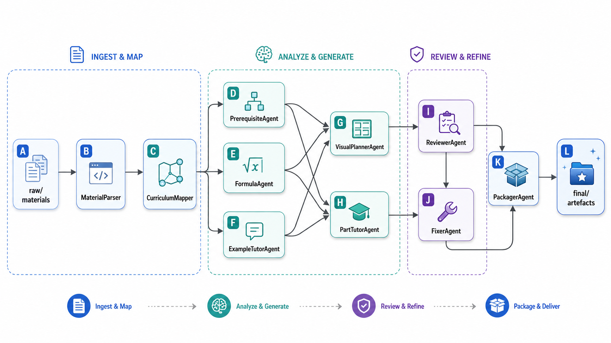

# STEM Learning Note Agent

> **Research-engineering demo (v0.1.15) — not product-ready.**
> Transforms STEM course materials into structured, reviewable learning notes through a
> multi-agent pipeline. Every artefact is labelled `needs_review=True`; nothing is presented
> as finished teaching content.

---

## 1. Problem Statement

Lecture slides and textbook chapters are dense, non-linear, and written for delivery — not
for self-study. A one-shot "summarise this PDF" prompt collapses structure, loses formula
provenance, and gives no way to audit what was hallucinated. This project explores a
different approach: a **pipeline of specialised agents** that each own one narrow task, write
typed JSON to a persistent workspace, and are audited by an independent reviewer that can
block bad output.

---

## 2. What It Builds

Given a folder of raw course materials (Markdown / TXT in this MVP), the pipeline produces:

| Output file | Description |
|---|---|
| `final/full_notes.md` | Per-part layered notes: intuition → formulas → examples → quiz |
| `final/revision_notes.md` | Flash-card-style summary for exam prep |
| `final/quiz.md` | Self-check questions keyed to each part |
| `final/visual_plan.md` | Visual TODO list (circuit diagrams, Bode plots, etc.) |
| `final/unresolved_issues.md` | Everything flagged but not resolved — for human review |
| `final/index.md` | Reading-order index |
| `review/*.md` | Per-part audit reports from the independent reviewer |

---

## 3. Key Features (MVP scope)

- **11-agent pipeline** with clear role boundaries and typed JSON contracts between stages
- **Persistent workspace**: every intermediate artefact survives a crash; pipeline is resumable
- **Independent reviewer** that audits drafts and can block content (never marks its own homework)
- **Source traceability**: every formula, example, and visual recommendation carries `source_refs`
- **Guardrails**: absolute promises, graded-answer risk, mock-marketing, verbatim copy detection
- **Safe fallback pattern**: every LLM call has 1 retry; failure → annotated fallback, not crash
- **Sub-batch example extraction**: large example sets split into ≤8-item batches so one model
  failure affects only that batch (env-configurable via `STEM_AGENT_EXAMPLE_LLM_BATCH_SIZE`)
- **Control-systems visual rules**: root locus, step response, z-plane, and block diagram visuals
  triggered by domain-specific keywords; RC circuit diagram only triggered for RC/resistor/capacitor
- **Fully offline default**: `MockLLMProvider` runs all 278+ tests with no API key

---

## 4. Architecture

### Agent roles

| Agent | Input | Output |
|---|---|---|
| `CourseLeaderAgent` | `raw/` manifest | workspace skeleton |
| `MaterialParserAgent` | raw files | `parsed/*.json` chunks |
| `CurriculumMapperAgent` | parsed chunks | `planning/course_map.json`, `part_outline.json` |
| `PrerequisiteAgent` | part outline | `planning/prerequisite_graph.json` |
| `FormulaAgent` | parsed chunks | `planning/formulas.json` |
| `ExampleTutorAgent` | parsed chunks + formulas | `planning/examples.json` |
| `VisualPlannerAgent` | part outline + formulas | `planning/visual_needs.json` |
| `PartTutorAgent` | part outline + formulas + examples | `drafts/part_*.json` |
| `ReviewerAgent` | drafts | `review/*.json` |
| `FixerAgent` | drafts + review | annotated drafts |
| `PackagerAgent` | all of the above | `final/` artefacts |

### Pipeline flow



### Workspace layout

```
<course_root>/
├── raw/          # user-owned; pipeline never writes here
├── parsed/       # MaterialParserAgent output
├── planning/     # CurriculumMapper, PrerequisiteAgent, FormulaAgent,
│                 # ExampleTutorAgent, VisualPlannerAgent output
├── drafts/       # PartTutorAgent output
├── review/       # ReviewerAgent audit reports
├── final/        # PackagerAgent: full_notes, revision, quiz, visual_plan, index
└── memory/       # slow-variable learner/course preferences (not cleared between runs)
```

---

## 5. Input Format

Place raw materials in `<course_root>/raw/`. The MVP parser handles:

| Format | Support |
|---|---|
| `.md` / `.txt` | Full parse — headings, body, formula chunks |
| `.pdf` | Title extraction + warning; body text requires external conversion |
| `.pptx` | Same as PDF — title only |

PDF/PPTX body content is out of scope for this MVP. Convert to Markdown first
(e.g. with `pandoc` or `pymupdf`) for full pipeline support.

---

## 6. Offline Demo (no API key required)

The bundled sample uses Markdown sources and `MockLLMProvider`.

```bash
# 1. Install
pip install -e ".[dev]"

# 2. Run end-to-end (mock LLM, no network)
python -m stem_learning_agent.cli run --course samples/course_001

# 3. Inspect results
python -m stem_learning_agent.cli status --course samples/course_001
cat samples/course_001/final/full_notes.md

# 4. Run tests (no API key, no network)
pytest -q
```

Expected test result: **278 passed, 1 skipped** (the skipped test requires
`RUN_DEEPSEEK_INTEGRATION_TESTS=1`).

---

## 7. DeepSeek Integration (optional)

The DeepSeek provider talks to `api.deepseek.com` using the OpenAI-compatible
chat-completions endpoint. **Never hard-code keys into source files.**

### Environment variables

| Variable | Required | Default | Notes |
|---|---|---|---|
| `DEEPSEEK_API_KEY` | yes | — | Your API key |
| `STEM_AGENT_LLM_PROVIDER` | yes | `mock` | Set to `deepseek` |
| `DEEPSEEK_BASE_URL` | no | `https://api.deepseek.com` | |
| `DEEPSEEK_MODEL` | no | `deepseek-v4-pro` | |
| `DEEPSEEK_THINKING_INTENSITY` | no | `max` | |
| `DEEPSEEK_TIMEOUT_SECONDS` | no | `60` | |
| `DEEPSEEK_JSON_MAX_TOKENS` | no | `4096` | Raise for large JSON outputs |
| `DEEPSEEK_DISABLE_THINKING_FOR_JSON` | no | `1` | Disables thinking mode for JSON calls |
| `STEM_AGENT_EXAMPLE_LLM_BATCH_SIZE` | no | `8` | Max examples per LLM batch |

### Windows PowerShell

```powershell
$env:DEEPSEEK_API_KEY = "sk-YOUR_KEY_HERE"
$env:STEM_AGENT_LLM_PROVIDER = "deepseek"
$env:DEEPSEEK_MODEL = "deepseek-v4-pro"
python -m stem_learning_agent.cli run --course path/to/your/course
```

### macOS / Linux

```bash
export DEEPSEEK_API_KEY="sk-YOUR_KEY_HERE"
export STEM_AGENT_LLM_PROVIDER="deepseek"
export DEEPSEEK_MODEL="deepseek-v4-pro"
python -m stem_learning_agent.cli run --course path/to/your/course
```

### Live integration tests (opt-in)

```bash
RUN_DEEPSEEK_INTEGRATION_TESTS=1 DEEPSEEK_API_KEY="sk-..." pytest tests/test_part_tutor_real_llm.py -v
```

Live tests are skipped by default so `pytest` passes on any machine without a key.

---

## 8. Test Status

| Suite | Tests | Network | API key |
|---|---|---|---|
| Core schemas + workspace | 40+ | no | no |
| MaterialParser | 20+ | no | no |
| CurriculumMapper / chunk_parts | 30+ | no | no |
| FormulaAgent + guardrails | 25+ | no | no |
| ExampleTutorAgent (batching) | 30+ | no | no |
| VisualPlannerAgent | 17 | no | no |
| PartTutor + Reviewer + Fixer | 30+ | no | no |
| PackagerAgent | 15+ | no | no |
| CLI + Orchestrator | 15+ | no | no |
| DeepSeek integration | 1 skipped | yes | yes (opt-in) |
| **Total** | **278 passed, 1 skipped** | | |

---

## 9. Demo Results (v0.1.15 live run)

Tested on 11 annotated EEEE3066 PDF lecture-note files.

| Metric | Result |
|---|---|
| Input materials | 11 (PDF-converted to Markdown) |
| Parts extracted | 15 |
| Formulas extracted | 12 |
| Examples extracted | 52 (across 7 batches of ≤8) |
| LLM batches (examples) | 7 — 0 failures |
| Visual plan items | 38 |
| Part notes generated | 15 |
| Review findings (high sev.) | 0 |
| `schema_validation_failed` markers | 0 |
| `llm_example_unavailable` fallbacks | 0 |
| Pipeline crashes | 0 |

All 15 artefacts (`full_notes.md`, `revision_notes.md`, `quiz.md`,
`visual_plan.md`, `unresolved_issues.md`) were generated successfully.

---

## 10. Version History

| Version | Key changes |
|---|---|
| v0.1.8 | Initial multi-agent scaffold; MockLLMProvider; offline tests |
| v0.1.9 | DeepSeekProvider; PartTutor real-LLM path; 1-retry + safe fallback |
| v0.1.10 | ReviewerAgent; FixerAgent; guardrails; PackagerAgent |
| v0.1.11 | PrerequisiteAgent; FormulaAgent enrichment; ExampleTutorAgent |
| v0.1.12 | PDF title extraction; VisualPlannerAgent heuristic rules |
| v0.1.13 | `_core_question_from_title` keyword table; cleaner part titles |
| v0.1.14 | `_is_bad_title` filter; batch JSON truncation fix (`DEEPSEEK_JSON_MAX_TOKENS`) |
| v0.1.15 | Sub-batch example extraction; s-to-z + transient-spec core questions; control-systems visual rules (root locus, step response, z-plane); RC pollution fix |

---

## 11. Known Limitations

| Limitation | Notes |
|---|---|
| PDF / PPTX body text | Not parsed; title extraction only. Convert externally first. |
| OCR | Not implemented. |
| Formula enrichment | Small heuristic glossary; all `needs_review=True`. |
| Curriculum mapping | Heading-driven heuristic; no LLM reasoning. |
| Prerequisites | Keyword rules only. |
| Visual rendering | Plans only — no diagram or image generation. |
| Fixer | Annotates drafts; does not auto-rewrite. |
| Reviewer | Rule-based + guardrails; no LLM reasoning. |
| Single-course sample | Only `course_001` (RC filter) bundled; EEEE3066 run requires own materials. |
| Part 004 core question | "close loop" (without 'd') not yet matched by regex — cosmetic only. |

---

## 12. Roadmap

See [docs/ROADMAP.md](docs/ROADMAP.md) for the full list. High-priority next:

1. PDF/PPTX body parser (pymupdf or unstructured)
2. LLM-powered reviewer (replace mechanical rule checks)
3. Auto-fix loop (Fixer rewrites, not just annotates)
4. Mermaid diagram generation for visual_plan items
5. Multi-course memory and prerequisite graph across courses

---

## 13. Safety and Academic Integrity

- All generated content is labelled `needs_review=True` and surfaced in `unresolved_issues.md`.
- Source references are attached to every formula, example, and visual recommendation.
- The pipeline explicitly flags absolute promises, graded-answer risk, and verbatim copy.
- **This tool is a study aid, not an exam shortcut.** Students remain responsible for
  understanding course material. Do not submit pipeline output as coursework.

---

## 14. Project Layout

```
stem_learning_agent/
├── core/           # schemas.py, workspace.py, config.py, errors.py, io_utils.py
├── harness/        # orchestrator.py, agent_base.py, tool_base.py,
│                   # context_manager.py, memory.py, guardrails.py
├── agents/         # 11 agents (leader, parser, mapper, prereq, formula,
│                   # example_tutor, visual_planner, part_tutor,
│                   # reviewer, fixer, packager)
├── tools/          # parse_document, extract_formulas, extract_examples,
│                   # chunk_parts, match_examples, write_note,
│                   # review_note, export_markdown
├── llm/            # LLMProvider interface, MockLLMProvider, DeepSeekProvider
├── prompts/        # one *.md per agent — prompt contracts
├── cli.py
└── main.py

samples/
└── course_001/raw/ # bundled demo: RC low-pass filter materials

tests/              # pytest suite — 278 passed, 1 skipped, no network required
docs/               # ARCHITECTURE.md, ROADMAP.md, WORKSPACE_SPEC.md,
                    # AGENT_ROLES.md, tasks/, demo_report.md
```

---

## 15. Design Principles

- **Artifacts over conversation**: every stage writes typed JSON/Markdown to the workspace.
  No pipeline state lives only in the LLM's context window.
- **Reviewer independence**: the generator never marks its own homework. ReviewerAgent
  is structurally separate from all content generators.
- **Fail loud on uncertainty**: `confidence`, `needs_review`, and warnings propagate to the
  final output. The Packager surfaces everything flagged — it does not silently drop issues.
- **No mock-as-production marketing**: every heuristic or mocked capability says so in
  the output and in this README.
- **Safe fallbacks, not crashes**: LLM failures produce annotated stubs with
  `needs_review=True`, not silent gaps or uncaught exceptions.

---

## 16. Quick Start (3 commands)

```bash
pip install -e ".[dev]"
python -m stem_learning_agent.cli run --course samples/course_001
cat samples/course_001/final/full_notes.md
```

For the live DeepSeek run on your own course materials, see §7 above.
